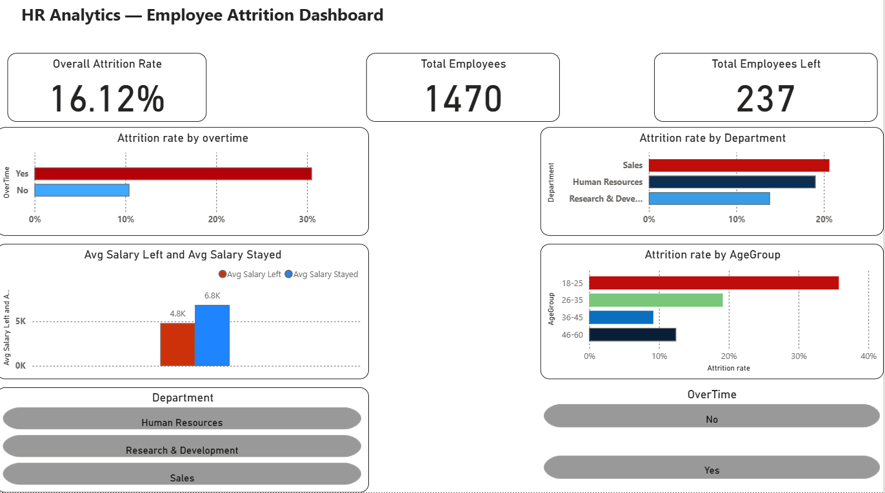

# HR Analytics — Employee Attrition Dashboard

## Project Overview
Analyzed IBM HR Analytics dataset of 1,470 employees to identify key drivers of employee attrition. Built an end-to-end analytics pipeline covering Python EDA, SQL-based analysis, and an interactive Power BI dashboard to uncover key attrition drivers.

## Problem Statement
The company has a 16.12% attrition rate — higher than the industry average of 10-12%. The goal was to identify which departments, age groups, and work conditions are driving employees to leave, and provide actionable recommendations to HR.

## 🛠️ Tools & Technologies

- **Python**: Pandas, NumPy, Matplotlib, Seaborn  
- **MySQL**: CTEs, Window Functions, Aggregations  
- **Power BI**: DAX, Power Query  

## Key Findings
- Overall attrition rate: 16.12%
- Sales department has the highest attrition at 20.6%
- Employees doing overtime leave at 3x the rate — 30.5% vs 10.4%
- Youngest employees (18-25) have the highest attrition at 34.8%
- Employees who left earned 30% less on average — ₹4,787 vs ₹6,833

## Business Recommendations
- Audit overtime policy in the Sales department immediately
- Introduce retention programs for employees under 25
- Review compensation for frontline sales roles — Sales Representatives are paid ₹6,220 below department average

## 📊 Dashboard Preview
Interactive Power BI dashboard visualizing attrition trends across departments, age groups, salary, and overtime patterns.

## 📁 Project Structure
End-to-end analytics workflow from data exploration to dashboard visualization.

hr_analytics/
│
├── eda.ipynb                       # Python EDA and visualizations
├── database.ipynb                  # ETL pipeline, loads data into MySQL
├── analysis_queries.sql            # SQL queries (CTEs, Window Functions)
├── HR_Analytics_Dashboard.pbix     # Power BI dashboard
└── dataset.csv                     # Source dataset

## Dataset
IBM HR Analytics Employee Attrition Dataset — [Kaggle](https://www.kaggle.com/datasets/pavansubhasht/ibm-hr-analytics-attrition-dataset)

## 📌 Conclusion
This project highlights how data analysis can uncover key workforce trends and support HR teams in making informed retention decisions.
